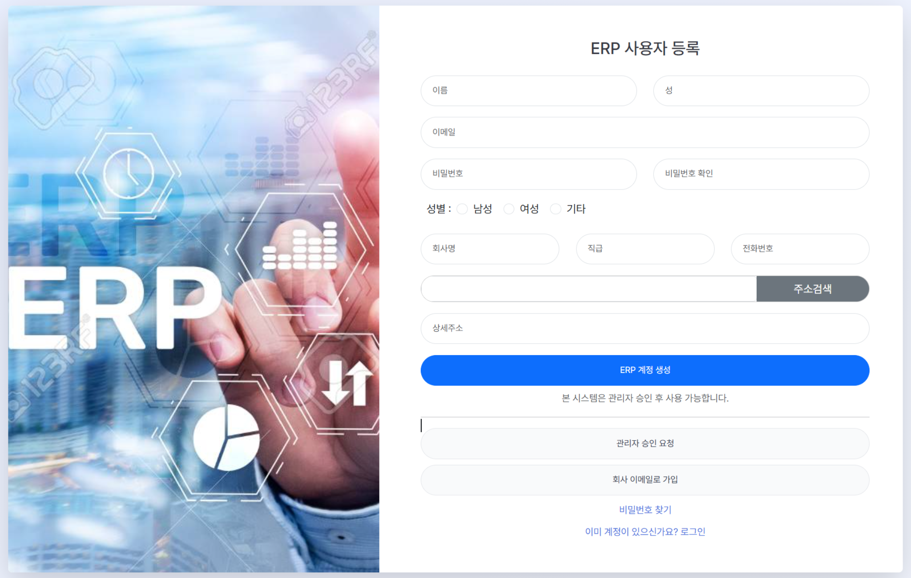
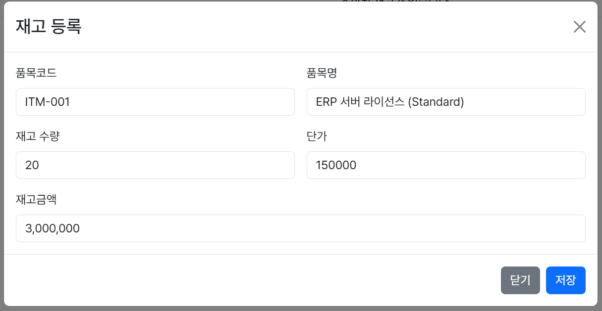
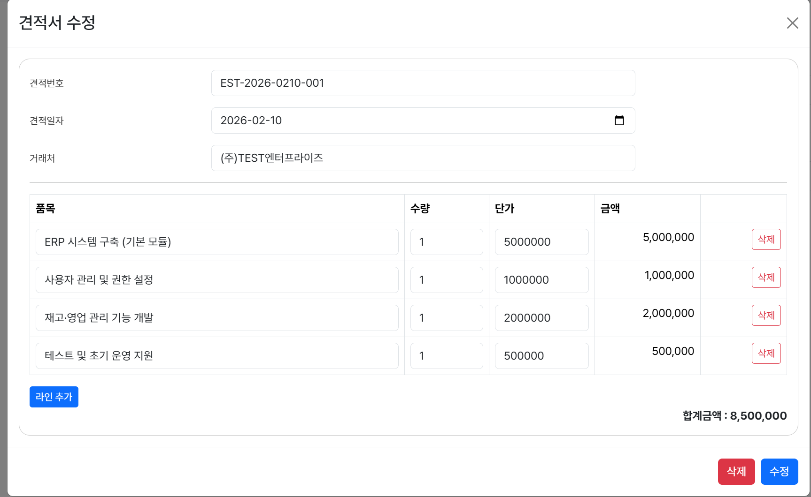
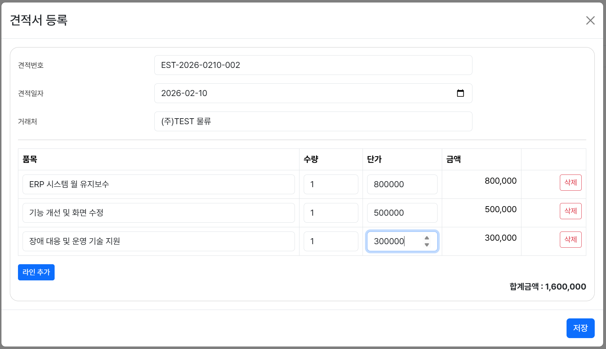
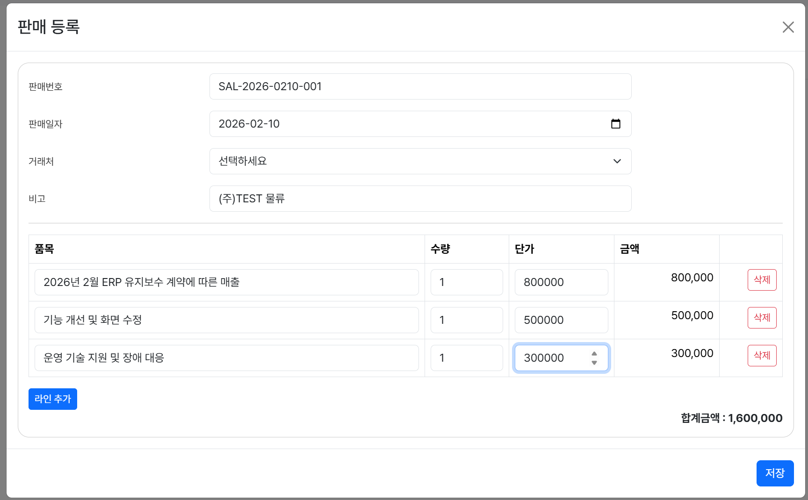
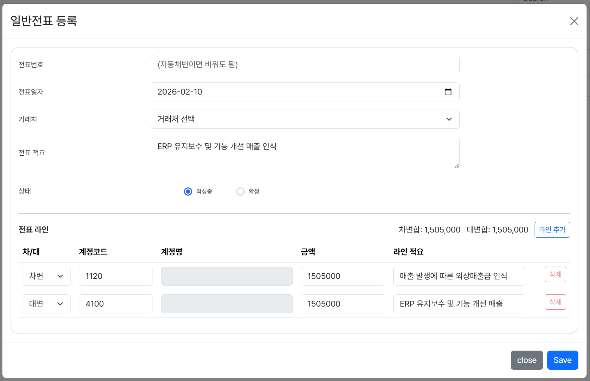
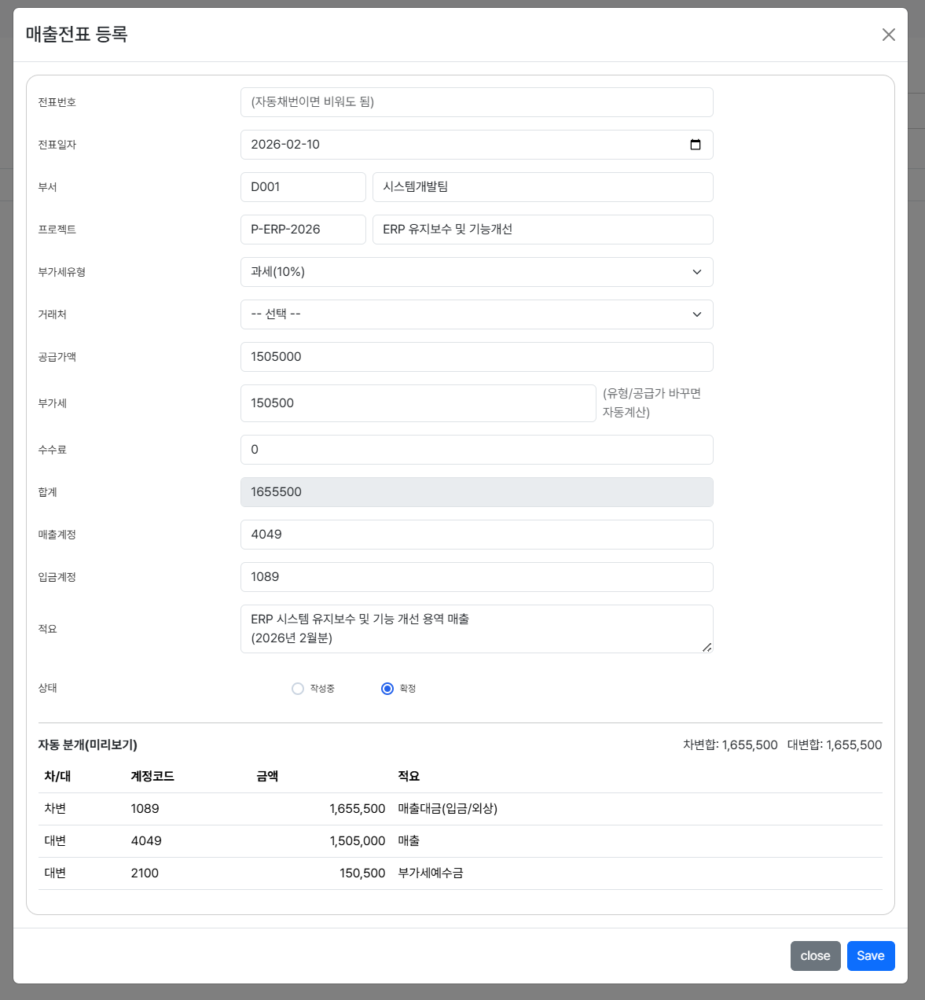

# ERP Frontend Web Application

본 프로젝트는 ERP 시스템의 **프론트엔드 아키텍처 및 UI/UX 설계 역량**에 초점을 둔 포트폴리오 프로젝트입니다.  
실제 ERP/MES 환경을 가정한 백엔드 REST API 구조를 기준으로 화면 연계를 고려하였으며,  
프론트엔드에서는 **인증·권한·업무 흐름 중심의 화면 설계와 상태 관리**에 집중하였습니다.

> 본 저장소는 **ERP 프론트엔드 포트폴리오 용도**로 제작되었습니다.

---

## 🔐 Authentication (Login & User Registration)

JWT 기반 인증 흐름을 고려하여 설계한 시스템 진입 및 사용자 등록 화면입니다.  
사용자 인증 상태 및 권한(Role)에 따라 접근 가능한 화면이 분기되도록 설계되었습니다.

### Login

- JWT 기반 인증 흐름을 고려한 로그인 UI
- 인증 정보는 LocalStorage 기반으로 관리
- 인증 만료 및 권한 오류 발생 시 강제 로그아웃 처리 흐름 고려

### User Registration (회원가입)

- ERP 사용자 등록을 위한 회원가입 화면
- 회사명, 직급, 연락처 등 **업무 시스템 필수 정보 입력 구조**
- **관리자 승인 후 계정 활성화** 방식 적용
- B2B ERP 환경에 적합한 사용자 관리 프로세스 반영

---

## 🛠 Tech Stack

### Frontend
- React 18
- TypeScript
- Vite

### UI / Styling
- Styled-components
- SCSS

### Auth / Integration
- JWT 기반 인증
- Role 기반 라우팅 제어

---

## 📁 Master Data Management (기준정보 관리)

### 📦 Inventory Registration (재고 등록)

- 품목 코드 및 품목명 기반 재고 관리
- 수량 × 단가 기반 재고 금액 자동 계산
- ERP 재고 관리 기본 흐름을 고려한 화면 설계

---

## 🔄 Transaction Management (거래 관리)

### 🧾 Estimate Registration (견적서 입력)

- 거래처 기준 견적 데이터 등록
- 다중 품목 입력 및 합계 금액 자동 계산
- 실무 ERP 견적서 작성 흐름 반영

### 🧾 Estimate Management (견적서 등록)

- 기존 견적 데이터 수정 및 관리
- 품목 단위 금액 변경 시 합계 자동 반영
- ERP 견적 관리 화면 구조를 기준으로 UI 설계

---

### 🧾 Sales Registration (판매 등록)

- 거래처 선택 후 판매 품목 다중 라인 입력
- 수량 × 단가 기반 금액 자동 계산
- 판매 합계 금액 실시간 반영

---

### 📑 Accounting Voucher (회계 전표 관리)

#### 일반전표 등록

- 차변 / 대변 구조 기반 전표 입력
- 전표 상태(작성중 / 확정) 관리
- ERP 회계 전표 흐름을 고려한 화면 구성

#### 매출전표 등록

- 매출 발생 시 자동 분개 구조 설계
- 공급가액 / 부가세 / 합계 자동 계산
- 차변·대변 분개 미리보기 제공
- 회계 흐름을 고려한 매출 인식 구조 반영

---

## 🚀 Key Features

- 로그인 / 회원가입 UI 구현
- ERP 기준정보 / 거래 / 회계 관리 화면 구성
- CRUD 기반 관리 화면 설계
- JWT 인증 상태 기반 접근 제어
- 사용자 권한(Role)에 따른 화면 분기
- 입력 오류를 최소화하기 위한 UX 중심 설계

---

## 🧠 Problem Solving

### 인증 상태 기반 접근 제어
- 로그인 여부 및 사용자 권한(Role)에 따른 라우팅 분기 구조 설계
- 화면 진입 단계에서 권한을 선제적으로 차단하여 불필요한 API 호출 방지

### ERP 업무 흐름을 고려한 화면 구성
- 기준정보 → 거래 → 회계 흐름을 기준으로 화면 구성

### 유지보수를 고려한 컴포넌트 분리
- 화면 단위 컴포넌트 분리로 가독성과 확장성 확보
- ERP 화면 특성상 기능 확장을 고려한 구조 설계

---

## ⭐ Portfolio Highlights

- ERP 기준정보 → 거래 → 회계 흐름에 대한 이해
- 실무 ERP UI 흐름을 반영한 프론트엔드 설계
- TypeScript 기반 타입 안정성 확보
- 백엔드 연동을 고려한 화면 구조 설계

---

## 👨‍💻 Developer

**이기창**  
ERP / MES 기반 웹 서비스 개발  
React (TypeScript) · Spring Boot 기반 풀스택 프로젝트

현업 업무 흐름을 이해하고,  
실제 현장에서 사용 가능한 시스템을 만드는 것을 지향합니다.
