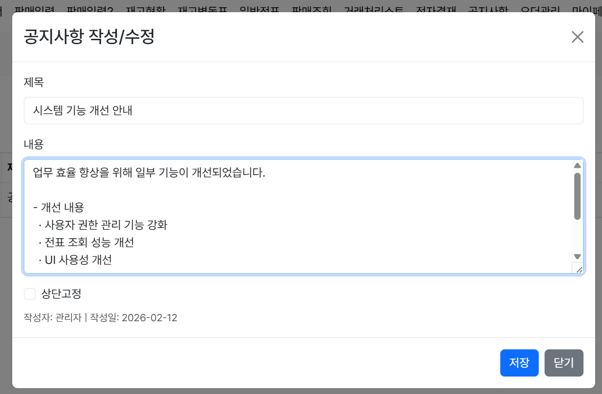
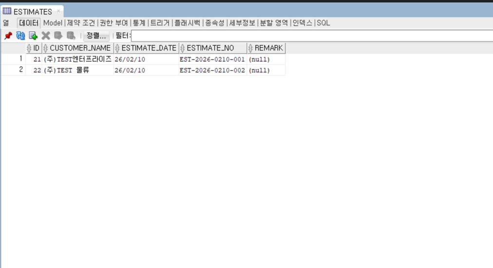
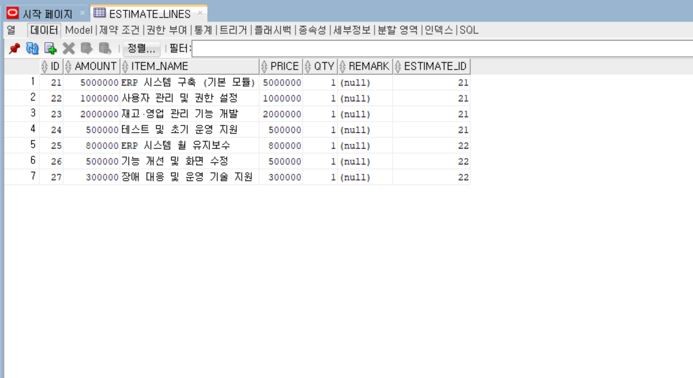

# ERP Frontend Web Application

본 프로젝트는 ERP 시스템의 **프론트엔드 아키텍처 및 UI/UX 설계 역량**에 초점을 둔 포트폴리오 프로젝트입니다.  
실제 ERP/MES 환경을 가정한 백엔드 REST API 구조를 기준으로 화면 연계를 고려하였으며,  
프론트엔드에서는 **인증·권한·업무 흐름 중심의 화면 설계와 상태 관리**에 집중하였습니다.

> 본 저장소는 **ERP 프론트엔드 포트폴리오 용도**로 제작되었습니다.

---

## 🔐 Authentication (Login & User Registration)

JWT 기반 인증 흐름을 고려하여 설계한 시스템 진입 및 사용자 등록 화면입니다.  
사용자 인증 상태 및 권한(Role)에 따라 접근 가능한 화면이 분기되도록 설계되었습니다.

### Login

- JWT 기반 인증 흐름을 고려한 로그인 UI
- 인증 정보는 LocalStorage 기반으로 관리
- 인증 만료 및 권한 오류 발생 시 강제 로그아웃 처리 흐름 고려

### User Registration (회원가입)

- ERP 사용자 등록을 위한 회원가입 화면
- 회사명, 직급, 연락처 등 **업무 시스템 필수 정보 입력 구조**
- **관리자 승인 후 계정 활성화** 방식 적용
- B2B ERP 환경에 적합한 사용자 관리 프로세스 반영

---

## 🛠 Tech Stack

### Frontend
- React 18
- TypeScript
- Vite

### UI / Styling
- Styled-components
- SCSS

### Auth / Integration
- JWT 기반 인증
- Role 기반 라우팅 제어

---

## 📁 Master Data Management (기준정보 관리)

### 📦 Inventory Registration (재고 등록)

- 품목 코드 및 품목명 기반 재고 관리
- 수량 × 단가 기반 재고 금액 자동 계산
- ERP 재고 관리 기본 흐름을 고려한 화면 설계

---

## 🔄 Transaction Management (거래 관리)

### 🧾 Estimate Registration (견적서 입력)

- 거래처 기준 견적 데이터 등록
- 다중 품목 입력 및 합계 금액 자동 계산
- 실무 ERP 견적서 작성 흐름 반영

### 🧾 Estimate Management (견적서 관리)

- 기존 견적 데이터 수정 및 관리
- 품목 단위 금액 변경 시 합계 자동 반영
- ERP 견적 관리 화면 구조를 기준으로 UI 설계

### 🧾 Sales Registration (판매 등록)

- 거래처 선택 후 판매 품목 다중 라인 입력
- 수량 × 단가 기반 금액 자동 계산
- 판매 합계 금액 실시간 반영

---

## 📦 Order Management (오더 관리)

ERP/MES 환경에서 오더의 **진행 상태를 단계별로 관리**하기 위한 화면입니다.  
발주부터 제작, 출고까지의 업무 흐름을 시스템 상에서 명확하게 추적할 수 있도록 설계되었습니다.

### 오더 진행단계 등록

- 오더관리번호 자동 생성 구조
- 월 단위 정기 발주 등 실무 오더 시나리오 반영
- 발주완료 / 제작중 / 출고완료 등 진행단계 관리
- ERP/MES 오더 흐름을 고려한 상태 기반 설계

---

## 📢 Notice Management (공지사항 관리)

시스템 운영 및 사용자 안내를 위한 **관리자 공지사항 관리 화면**입니다.  
ERP 시스템 특성상 사용자에게 전달되어야 할 시스템 변경 사항을 효율적으로 관리할 수 있도록 구성했습니다.

### 공지사항 등록 / 수정

- 시스템 기능 개선 및 점검 안내 공지 관리
- 제목 / 내용 기반 공지사항 등록·수정
- 상단 고정 여부 설정을 통한 중요 공지 강조
- 관리자 권한 기반 접근 화면 설계

---

## 🗄 Database Snapshot (Estimate Structure)

견적서 입력 화면은  
실제 ERP 시스템의 **Header–Line(1:N) 구조**를 기준으로 설계되었으며,  
프론트엔드 입력 UI와 DB 저장 구조 간의 **명확한 매핑**을 고려하여 구현하였습니다.

### 📄 Estimate (Header)

- 견적 문서 단위 관리 테이블
- 거래처, 견적일자, 견적번호 등 상위 문서 정보 관리
- 하나의 견적(Header)에 다수의 품목(Line)이 연결되는 1:N 구조

### 📄 Estimate Lines (Detail)

- 견적서 품목(Line) 단위 관리 테이블
- 단가 × 수량 기반 금액 계산 구조
- 프론트엔드 다중 품목 입력 UI와 1:1 매핑

---

## 🚀 Key Features

- 로그인 / 회원가입 UI 구현
- ERP 기준정보 / 거래 / 회계 / 오더 관리 화면 구성
- CRUD 기반 관리 화면 설계
- JWT 인증 상태 기반 접근 제어
- 사용자 권한(Role)에 따른 화면 분기
- 입력 오류를 최소화하기 위한 UX 중심 설계

---

## 👨‍💻 Developer

**이기창**  
ERP / MES 기반 웹 서비스 개발  
React (TypeScript) · Spring Boot 기반 풀스택 프로젝트  

현업 ERP 업무 흐름과 데이터 구조를 이해하고,  
프론트엔드 화면을 업무 단위·문서 단위로 설계하는 개발자를 지향합니다.
