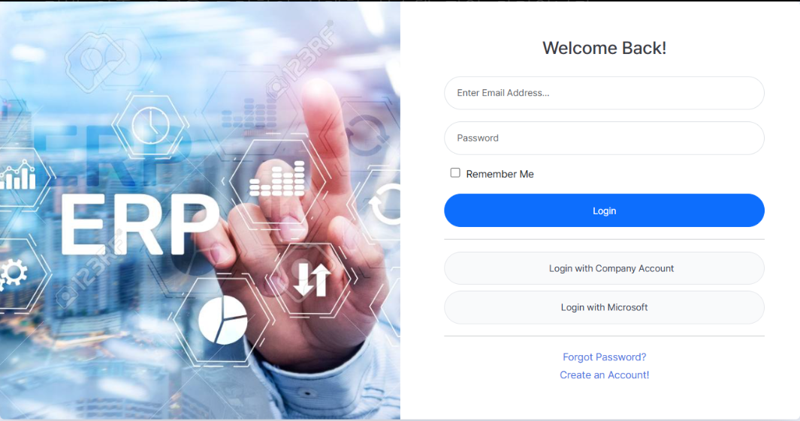
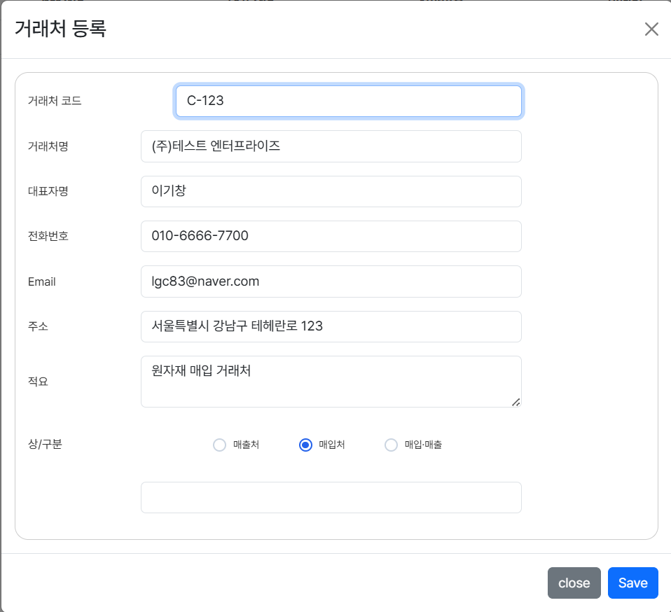
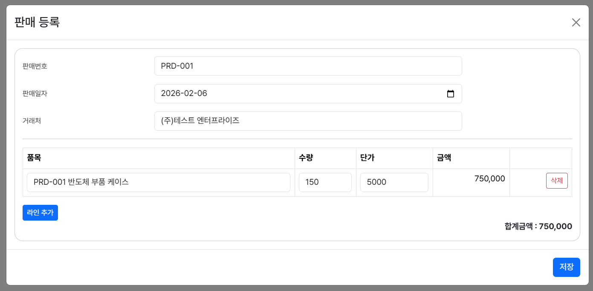
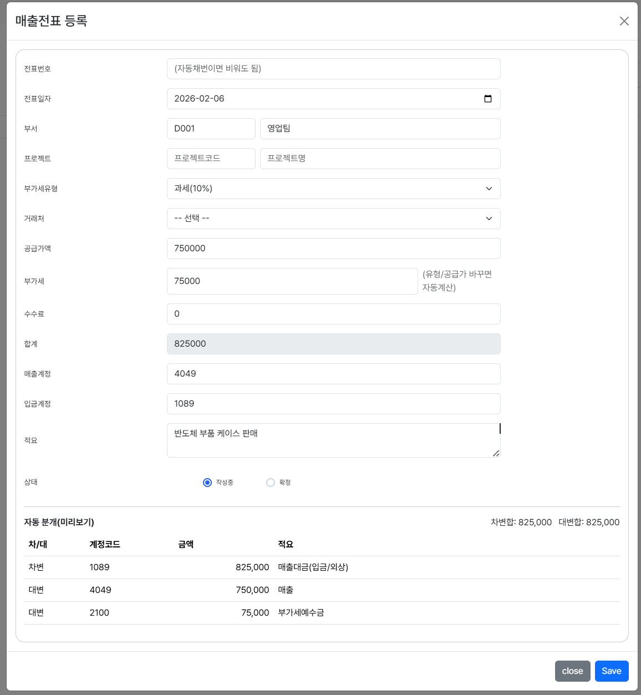

# ERP Frontend Web Application

본 프로젝트는 ERP 시스템의 **프론트엔드 아키텍처 및 UI/UX 설계 역량**에 초점을 둔 프로젝트입니다.  
백엔드 API는 실제 ERP/MES 환경을 가정하여 설계된 REST API 구조를 기준으로 연동을 고려하였으며,  
프론트엔드에서는 **인증·권한·업무 흐름 중심의 화면 설계와 상태 관리**에 집중하였습니다.
본 저장소는 ERP 프론트엔드 포트폴리오 용도로 제작되었습니다.

---

## 🔐 ERP Login / Sign Up

JWT 기반 인증 흐름을 고려하여 설계한 시스템 진입 화면입니다.  
인증 상태 및 사용자 권한(Role)에 따라 접근 가능한 화면이 분기됩니다.

### Login

- 인증 정보는 LocalStorage 기반으로 관리하되,
  인증 만료 및 권한 오류 발생 시 강제 로그아웃 처리 흐름을 고려하여 설계

### Sign Up

---

## 🛠 Tech Stack

### Frontend
- React 18
- TypeScript
- Vite

### UI / Styling
- Styled-components
- SCSS

### Auth / Integration
- JWT 기반 인증
- Role 기반 라우팅 제어

---

## 📁 Master Data Management (기준정보 관리)

### 🔗 Customer Registration (거래처 등록)

영업·구매·회계 전반에서 공통으로 참조되는  
거래처 마스터 데이터를 등록·관리하는 기준정보 화면입니다.

**주요 기능**
- 거래처 마스터 데이터 등록 및 관리
- 매출처 / 매입처 구분 관리
- 실무 ERP 거래처 관리 화면 흐름을 기준으로 UI 설계

---

### 📦 Item Registration (품목 등록)

제조·유통 ERP 품목 구조를 참고하여  
실제 실무에서 사용되는 품목 기준정보를 관리하는 화면입니다.

**주요 기능**
- 원재료 / 부재료 / 제품 / 반제품 / 상품 유형별 관리
- 규격, 단위, 생산공정, 단가(VAT 포함 여부) 설정
- 세트 품목 여부 및 사용 / 미사용 상태 관리

---

## 🔄 Transaction Management (거래 관리)

### 🧾 Sales Registration (판매 등록)

거래처 선택 후 다수 품목을 입력하여  
판매 데이터를 등록하는 실무형 판매 관리 화면입니다.

**주요 기능**
- 거래처 선택 후 판매 품목 다중 라인 입력
- 수량 × 단가 기반 금액 자동 계산
- 판매 합계 금액 실시간 반영

---

### 📑 Sales Voucher Registration (매출전표 등록)

판매 데이터를 기반으로 회계 매출전표를 자동 생성하는 화면입니다.

- 금액 계산 로직은 프론트 단에서 선계산하여 사용자 입력 오류를 사전에 방지
- 서버 전송 전 데이터 정합성 검증 흐름 고려

**주요 기능**
- 공급가액 / 부가세 / 합계 자동 계산
- 매출계정 / 입금계정 분리 관리
- 차변·대변 자동 분개 미리보기 제공
- 회계 흐름을 고려한 전표 구조 설계

---

## 🚀 Key Features

- 로그인 / 회원가입 UI 구현
- ERP 기준정보 및 거래 관리 화면 구성
- CRUD 기반 관리 화면 설계
- JWT 인증 상태 기반 접근 제어
- 사용자 권한(Role)에 따른 화면 분기
- 화면 단에서 입력 오류를 최소화하기 위한 UX 중심 설계

---

## 🧠 Problem Solving

### 인증 상태 기반 접근 제어
- 로그인 여부 및 사용자 권한(Role)에 따른 라우팅 분기 구조 설계
- 화면 진입 단계에서 권한을 선제적으로 차단하여 불필요한 API 호출 방지

### ERP 업무 흐름을 고려한 화면 구성
- 기준정보 → 거래 → 회계 흐름을 기준으로 화면 구성

### 유지보수를 고려한 컴포넌트 분리
- 화면 단위 컴포넌트 분리로 가독성과 확장성 확보
- ERP 화면 특성상 기능 확장을 고려한 구조 설계

---

## ⭐ Portfolio Highlights

- ERP 기준정보 → 거래 → 회계 흐름에 대한 이해
- 실무 ERP UI 흐름을 반영한 프론트엔드 설계
- TypeScript 기반 타입 안정성 확보
- 백엔드 연동을 고려한 화면 구조 설계

---

## 👨‍💻 Developer

**이기창**  
ERP / MES 기반 웹 서비스 개발  
React (TypeScript) · Spring Boot 기반 풀스택 프로젝트

현업 업무 흐름을 이해하고,  
실제 현장에서 사용 가능한 시스템을 만드는 것을 지향합니다.
